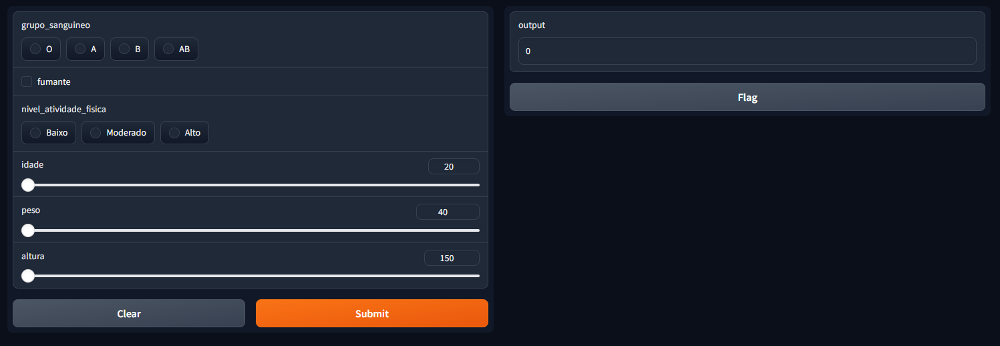

# Modelo colesterol - Regressão Linear Multipla

### Algoritmo Supervisionado com Regressão Linear Múltipla. O objetivo é explorar interações e influências de variáveis, iniciando com EDA, seguido da construção do modelo, até finalizar com a implementação de uma Interface de Usuário (UI)


## Instalar venv e requirements
```
python -m venv venv
.\venv\Scripts\activate
pip install -r requirements.txt
```

